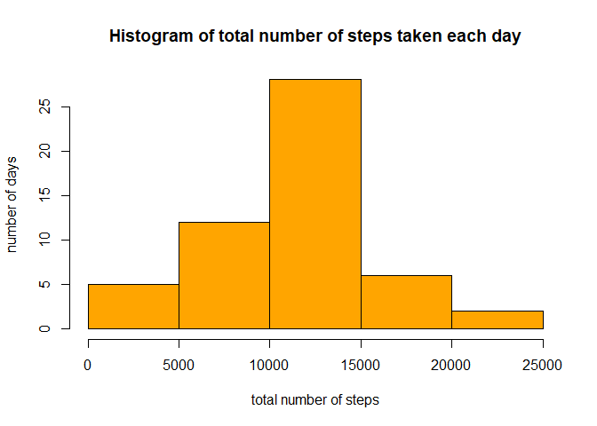
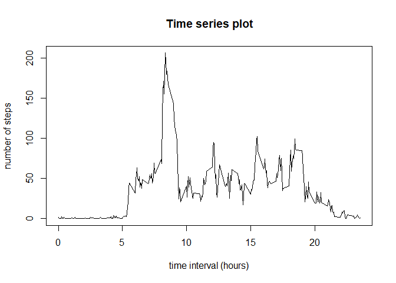
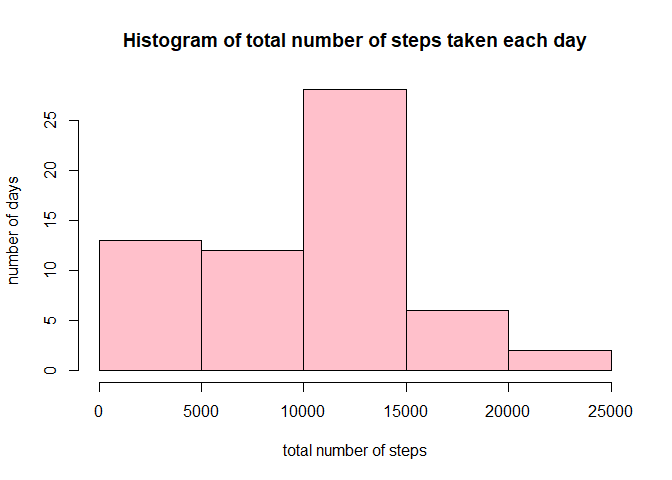
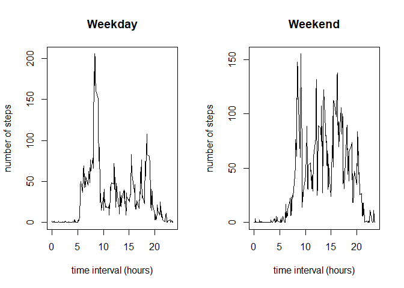

## Loading and preprocessing the data


```r
setwd("C:/Users/Harshada Sasturkar/Desktop/RepData_PeerAssessment1")
activity<-read.csv("./activity/activity.csv")
```

The interval column in activity data frame represents time as integer. To distinguish between hours and minutes I created a new column activity$hh.mm where interval is stored in 'hh.mm' format. Also dates are converted into 'Date' format.


```r
activity$hh.mm<-activity$interval/100
activity$date<-as.Date(activity$date)
str(activity)
```

```
## 'data.frame':	17568 obs. of  4 variables:
##  $ steps   : int  NA NA NA NA NA NA NA NA NA NA ...
##  $ date    : Date, format: "2012-10-01" "2012-10-01" ...
##  $ interval: int  0 5 10 15 20 25 30 35 40 45 ...
##  $ hh.mm   : num  0 0.05 0.1 0.15 0.2 0.25 0.3 0.35 0.4 0.45 ...
```


## What is mean total number of steps taken per day?

### 1. Total number of steps taken per day:
 Observations in which no measurements of steps were taken are excluded


```r
step<-subset(activity,!is.na(activity$steps))
tsteps<-tapply(step$steps,step$date,sum)
tsteps
```

```
## 2012-10-02 2012-10-03 2012-10-04 2012-10-05 2012-10-06 2012-10-07 2012-10-09 
##        126      11352      12116      13294      15420      11015      12811 
## 2012-10-10 2012-10-11 2012-10-12 2012-10-13 2012-10-14 2012-10-15 2012-10-16 
##       9900      10304      17382      12426      15098      10139      15084 
## 2012-10-17 2012-10-18 2012-10-19 2012-10-20 2012-10-21 2012-10-22 2012-10-23 
##      13452      10056      11829      10395       8821      13460       8918 
## 2012-10-24 2012-10-25 2012-10-26 2012-10-27 2012-10-28 2012-10-29 2012-10-30 
##       8355       2492       6778      10119      11458       5018       9819 
## 2012-10-31 2012-11-02 2012-11-03 2012-11-05 2012-11-06 2012-11-07 2012-11-08 
##      15414      10600      10571      10439       8334      12883       3219 
## 2012-11-11 2012-11-12 2012-11-13 2012-11-15 2012-11-16 2012-11-17 2012-11-18 
##      12608      10765       7336         41       5441      14339      15110 
## 2012-11-19 2012-11-20 2012-11-21 2012-11-22 2012-11-23 2012-11-24 2012-11-25 
##       8841       4472      12787      20427      21194      14478      11834 
## 2012-11-26 2012-11-27 2012-11-28 2012-11-29 
##      11162      13646      10183       7047
```

### 2. Histogram of the total number of steps taken each day:


```r
 hist(tsteps,xlab="total number of steps",ylab="number of days",main="Histogram of total number of steps taken each day",col="orange")
```

<!-- -->

### 3. Mean and median of the total number of steps taken per day:


```r
mean(tsteps)
```

```
## [1] 10766.19
```

```r
median(tsteps)
```

```
## [1] 10765
```

## What is the average daily activity pattern?
### 1. Time series plot of the 5-minute interval (x-axis) and the average number of steps taken, averaged across all days (y-axis)

Average number of steps grouped by time interval, averaged across all days:


```r
intsteps<-tapply(activity$steps,activity$hh.mm,mean,na.rm=TRUE)
```

Time series plot:


```r
plot(names(intsteps),intsteps,type="l",xlab="time interval (hours)",ylab="number of steps",main="Time series plot")
```

<!-- -->

### 2. The 5-minute interval, on average across all the days in the dataset, containing the maximum number of steps:


```r
which.max(intsteps)
```

```
## 8.35 
##  104
```

i.e. 8 hr 35 min is that time interval (at index 104)

## Imputing missing values

### 1. Total number of missing values in the dataset:


```r
 sum(is.na(activity))
```

```
## [1] 2304
```

### 2. filling in all of the missing values in the dataset:

I've used median values of steps for each time interval.


```r
medianint<-tapply(step$steps,step$interval,median)
medianint
```

```
##    0    5   10   15   20   25   30   35   40   45   50   55  100  105  110  115 
##    0    0    0    0    0    0    0    0    0    0    0    0    0    0    0    0 
##  120  125  130  135  140  145  150  155  200  205  210  215  220  225  230  235 
##    0    0    0    0    0    0    0    0    0    0    0    0    0    0    0    0 
##  240  245  250  255  300  305  310  315  320  325  330  335  340  345  350  355 
##    0    0    0    0    0    0    0    0    0    0    0    0    0    0    0    0 
##  400  405  410  415  420  425  430  435  440  445  450  455  500  505  510  515 
##    0    0    0    0    0    0    0    0    0    0    0    0    0    0    0    0 
##  520  525  530  535  540  545  550  555  600  605  610  615  620  625  630  635 
##    0    0    0    0    0    0    0    0    0    0    0    0    0    0    0    0 
##  640  645  650  655  700  705  710  715  720  725  730  735  740  745  750  755 
##    0    0    8   13    7   13   14    0    0   12    0    0   15   19   19   28 
##  800  805  810  815  820  825  830  835  840  845  850  855  900  905  910  915 
##   41   25   32   13   45   33   37   19   51   60   16   43   20    8   31   15 
##  920  925  930  935  940  945  950  955 1000 1005 1010 1015 1020 1025 1030 1035 
##   16    0    0    0    0    0    0    0    0    0    0    0    0    0    0    0 
## 1040 1045 1050 1055 1100 1105 1110 1115 1120 1125 1130 1135 1140 1145 1150 1155 
##    0    0    0    0    0    0    0    0    0    0    0    0    0    0    0    0 
## 1200 1205 1210 1215 1220 1225 1230 1235 1240 1245 1250 1255 1300 1305 1310 1315 
##    0    0    6   10    0    0    0    0    0    0    0    0    0    0    0    0 
## 1320 1325 1330 1335 1340 1345 1350 1355 1400 1405 1410 1415 1420 1425 1430 1435 
##    0    0    0    0    0    0    0    0    0    0    0    0    0    0    0    0 
## 1440 1445 1450 1455 1500 1505 1510 1515 1520 1525 1530 1535 1540 1545 1550 1555 
##    0    0    0    0    0    0    0    0    0    0    0    0    0    0    0    0 
## 1600 1605 1610 1615 1620 1625 1630 1635 1640 1645 1650 1655 1700 1705 1710 1715 
##    0    0    0    0    0    0    0    0    0    0    0    0    0    0    0    7 
## 1720 1725 1730 1735 1740 1745 1750 1755 1800 1805 1810 1815 1820 1825 1830 1835 
##    7    0    7    7   26    7    0   10   15   18   26   25   24    9   33   26 
## 1840 1845 1850 1855 1900 1905 1910 1915 1920 1925 1930 1935 1940 1945 1950 1955 
##   34   42   33   30   33   30    8    8    7    0    0    0    0    0    0    0 
## 2000 2005 2010 2015 2020 2025 2030 2035 2040 2045 2050 2055 2100 2105 2110 2115 
##    0    0    0    0    0    0    0    0    0    0    0    0    0    0    0    0 
## 2120 2125 2130 2135 2140 2145 2150 2155 2200 2205 2210 2215 2220 2225 2230 2235 
##    0    0    0    0    0    0    0    0    0    0    0    0    0    0    0    0 
## 2240 2245 2250 2255 2300 2305 2310 2315 2320 2325 2330 2335 2340 2345 2350 2355 
##    0    0    0    0    0    0    0    0    0    0    0    0    0    0    0    0
```

(step is the data frame without missing value rows) 

### 3. A new dataset that is equal to the original dataset but with the missing data filled in:


```r
activity1<-activity
while(sum(is.na(activity1))!=0)
{activity1$steps[which(is.na(activity1))]<-medianint[which(activity1$interval[which(is.na(activity1))]==names(medianint))]}
```

The intervals of missing value rows in new data set (activity1) are matched with the intervals(names) of medianint and the values are filled accordingly.

### 4. Histogram of the total number of steps taken each day:


```r
tsteps1<-tapply(activity1$steps,activity1$date,sum)
hist(tsteps1,xlab="total number of steps",ylab="number of days",main="Histogram of total number of steps taken each day",col="pink")
```

<!-- -->

### 5. Mean and median total number of steps taken per day:


```r
mean(tsteps1)
```

```
## [1] 9503.869
```

```r
median(tsteps1)
```

```
## [1] 10395
```

These values differ from the previous ones (mean=10766.19,median=10765). From the histogram it is seen that imputing missing values lead to rise in number of days having total number of steps between 0-5000. Also the mean and median are affected by increased number of observations which weren't previously considered. 

## Are there differences in activity patterns between weekdays and weekends?

### 1. Creating new factor variable in the dataset with two levels – “weekday” and “weekend” indicating whether a given date is a weekday or weekend day:


```r
activity1$wdays <- factor(ifelse(weekdays(activity1$date)=="Saturday"|weekdays(activity1$date)=="Sunday", "weekend", "weekday"))
```

### 2. A panel plot containing a time series plot of the 5-minute interval (x-axis) and the average number of steps taken, averaged across all weekday days or weekend days (y-axis):


```r
awday<-subset(activity1,activity1$wdays=="weekday")
awend<-subset(activity1,activity1$wdays=="weekend")
intsteps1<-tapply(awday$steps,awday$hh.mm,mean)
intsteps2<-tapply(awend$steps,awend$hh.mm,mean)
par(mfrow=c(1,2))
plot(names(intsteps1),intsteps1,type="l",xlab="time interval (hours)",ylab= "number of steps", main="Weekday")
plot(names(intsteps2),intsteps2,type="l",xlab="time interval (hours)",ylab= "number of steps", main="Weekend")
```

<!-- -->
